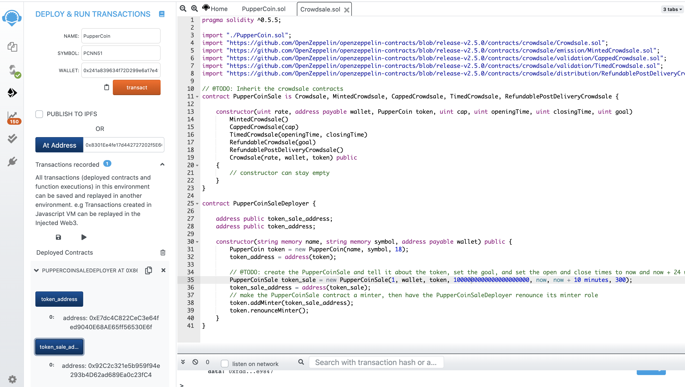
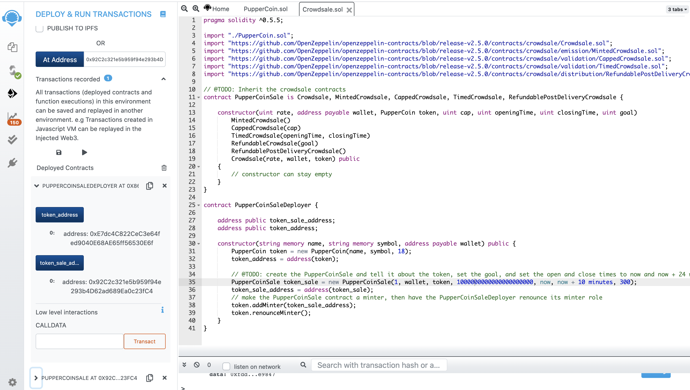
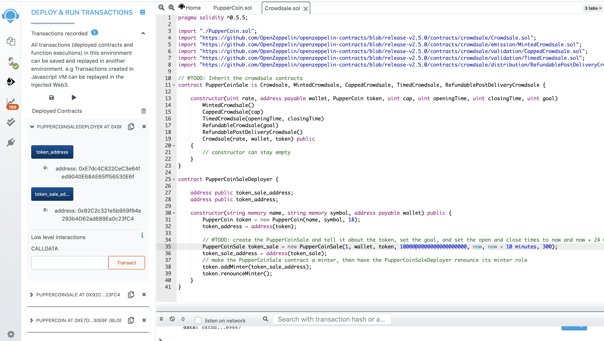
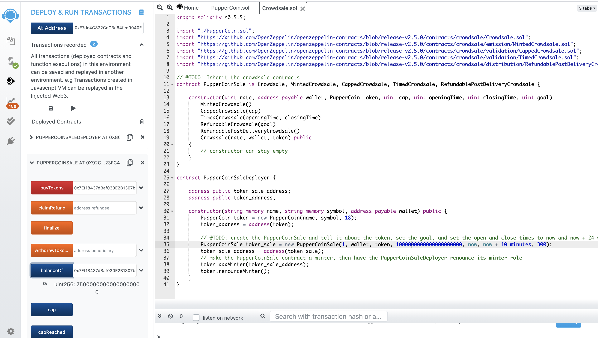
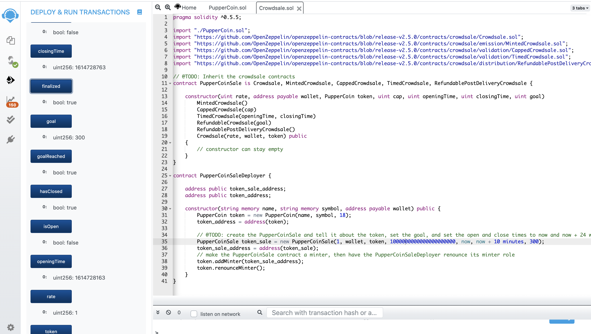
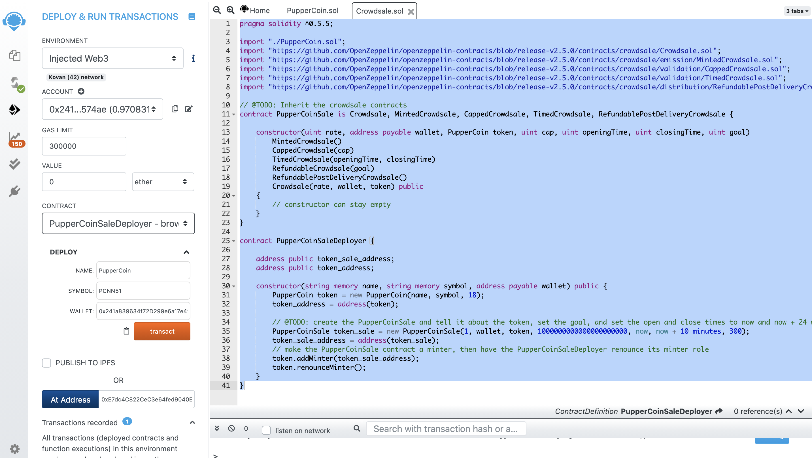
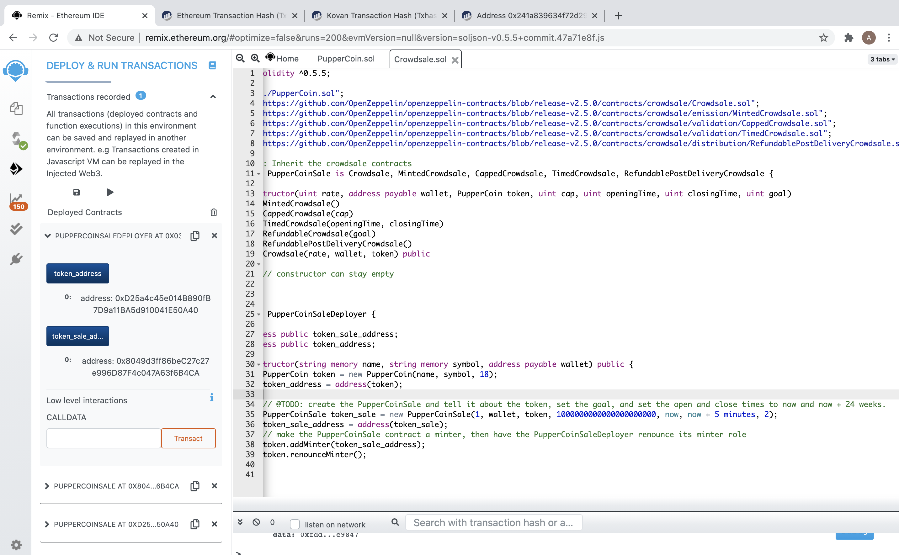
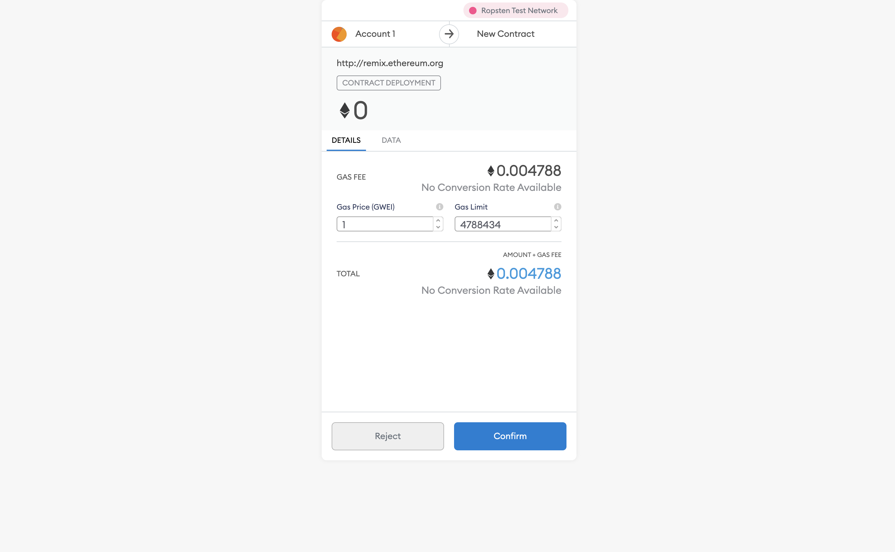
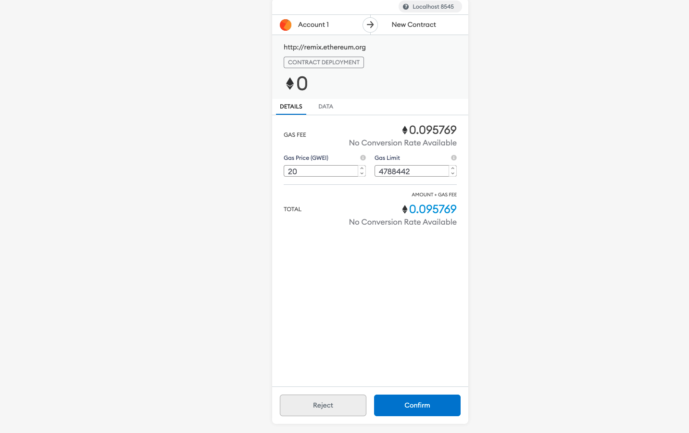
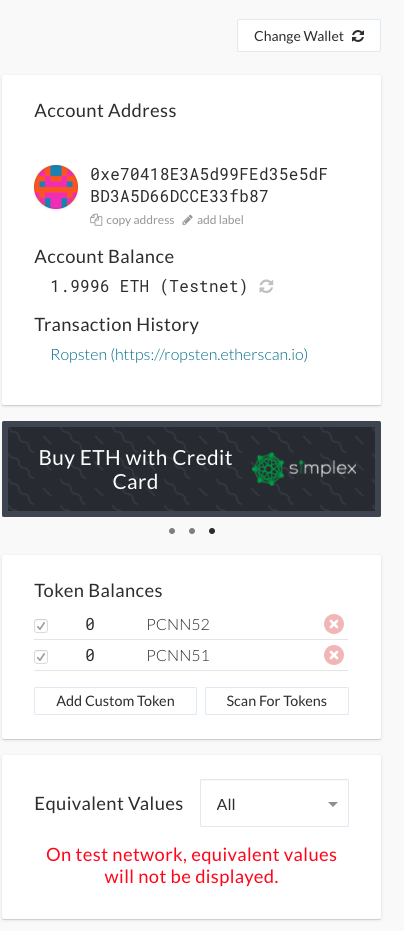

# PupperCoin Crowdsale

## Introduction

For this assignment we were asked to create a crowdsale, open to the public, that will sell the PupperCoin Token in order to fund network development. The network will be used to track the dog breeding activity across the globe in a decentralized way, and allow humans to track the genetic trail of their pets.

## PupperCoin Token

The first step is to create the PupperCoin as an ERC20Mintable token, the technical standard for smart contracts on the Ethereum blockchain.

The decimal points for the token are set to 18 decimals because all of the math done in the contract is done on the smallest currency unit, which is 1 wei (1 ETH === 10^18 wei).

## PupperCoin Crowdsale Contract

The contract that we used for the crowdsale inherits from the following OpenZeppelin contracts:

- Crowdsale
- MintedCrowdsale
- CappedCrowdsale
- TimedCrowdsale
- RefundablePostDeliveryCrowdsale

## PupperCoin Deployment Contract

The deployment contract is contained in the same file as the crowdsale contract and can delpoy to our local blockchain or a testnet.

## Testing the Crowdsale

We deployed the contract to our local blockchain first to test it using the following steps:

- Step one is to deploy the PupperCoinSale Deployer Contract:

- Step two is to copy the token_sale_address and deploy the PupperCoinSale contract:

- Step three is to copy the token_address and deploy the PupperCoin:

- Step four is to buy tokens using other addresses:

- Step five is to confirm that the time has run out and the contract is no longer open:

- Step six is to finalize the contract:

## Deploy to Ropsten Testnet

Using the deploy tab in Remix, we deployed the contract in the same manner as above except it was deployed to the Ropsten testnet. 

The Gas Fee for the local blockchain appears to be higher than it is to deploy the contract to the testnet:

The remaining steps are the same as above, except all the transactions are conducted on the testnet.

## MyCrypto

The custom tokens can be added to your MyCrypto Wallet:

